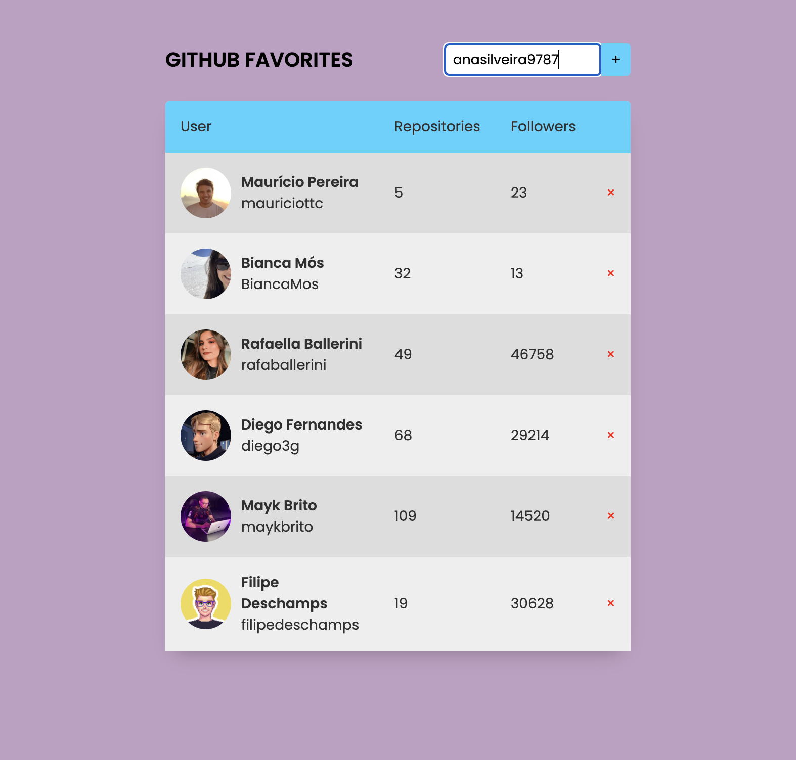
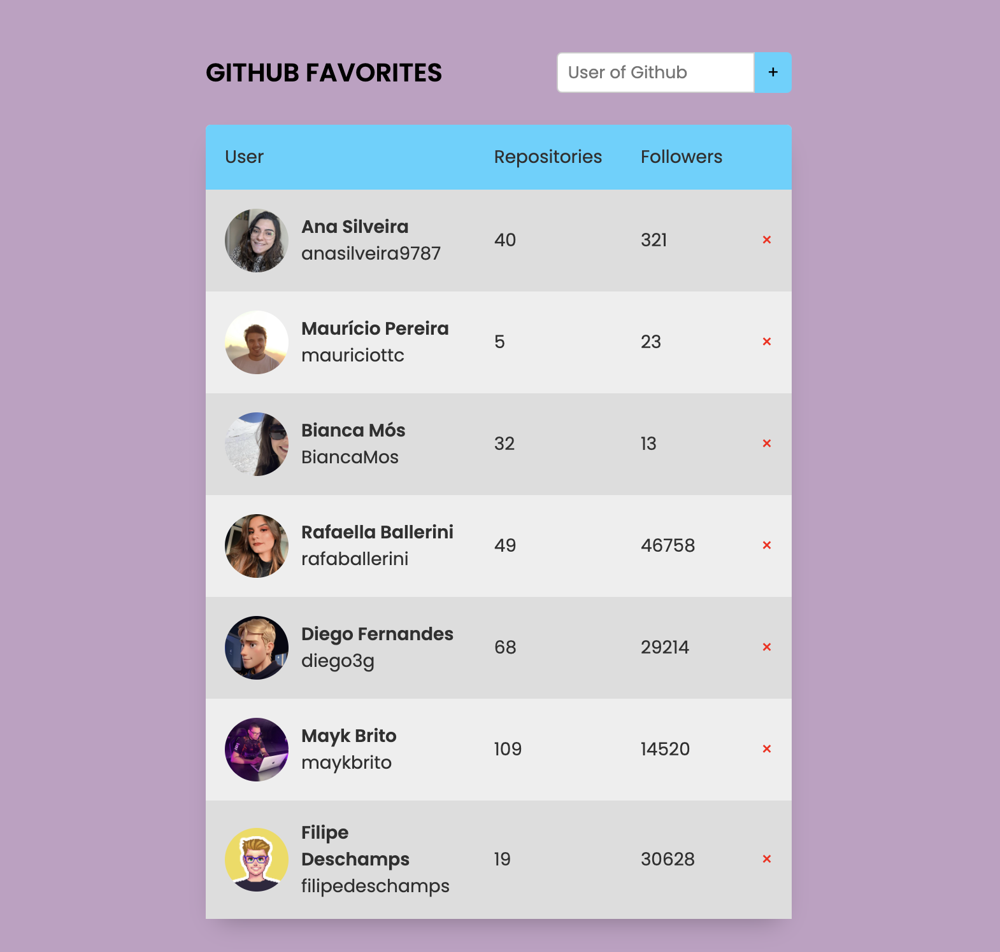
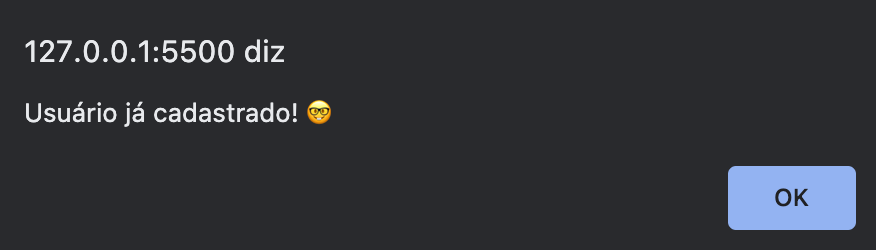
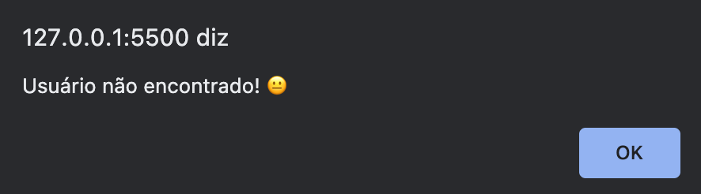
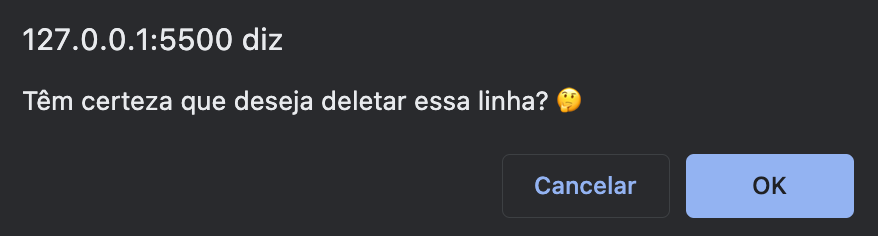

# 🦊 Github Favorites

🇺🇸 In this Github Favorites project, I had the objective of building a basic HTML, I created the addition of the JS module type, in the header using defer, in the styles, tables, HTML and CSS.

I created object orientation in JS, saving the data in local storage;

I performed asynchronous functions, with promises, await, try, catch and throw;

I used Higher-order functions;

Data immutability;

DOM / Events;

Remove elements from the screen;

Fetch to fetch the endpoint;

I worked with JSON, structure and manipulation of Data.

The objective of searching for the username with this API is that you can obtain information pulled directly from Github, where you can check the person's photo, name, number of repositories and number of followers.
Still on this page, it is possible not to create the same user already registered, delete the existing user, ask if you are sure about the option to delete the user and if the user is not found / does not exist, you will also be notified.

🇧🇷 Neste projeto Github Favoritos, tive o objetivo de contruir um HTML básico, criei a adição do JS tipo módulo, no cabeçalho usando defer, nos estilos, tabelas, HTML e CSS. 

Criei orientação ao objeto no JS, salvando os dados no local storage;

Realizei funções assíncronas, com promessas, await, try, catch e throw; 

Utilizei o Higher-order functions;

Imultabilidade de dados;

DOM / Eventos;

Remover elementos da tela; 

Fetch para buscar o endpoint;

Trabalhei com o JSON, estrutura e manipulação dos Dados. 

O objetivo ao buscar o nome de usuário com essa API é que você consiga obter as informações puxadas diretamente do Github, onde você confere a foto da pessoa, nome, a quantidade de repositórios e a quantidade de seguidores.
Ainda nesta página, é possível não criar o mesmo usuário já cadastrado, excluir o usuário existente, perguntar se tem certeza na opção de excluir o usuário e se acaso o usuário não for localizado / não existir, também será notificado.  

📸 Screenshots of project:

# 🚀 Techologies

- [HTML](../index.html)
- [CSS](../style.css)
- [JavaScript](../js/Favorites.js)
- [DOM]()
- [JSON]()
- [Github]()

## 🗓️ 
October 2023

                  Feito com 💜 by Bianca Mós